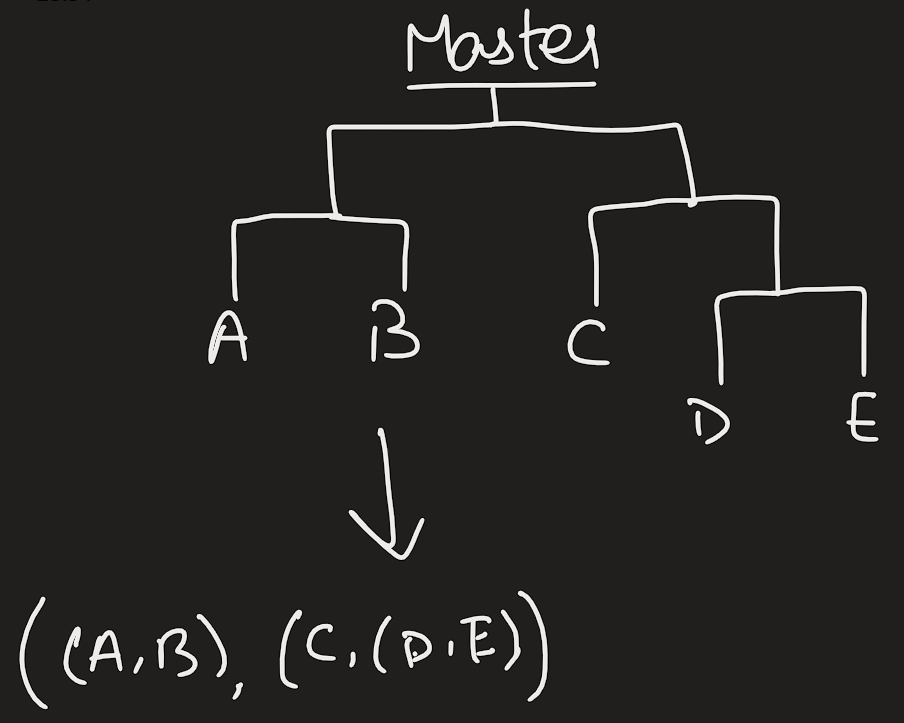

# Dawrin Hackathon 2022-23

**Disclaimer**: We @ Turing are not a great fan of biology in general. We tried to get a few people having biology as well as in coding to help us with the questions, but apparently participating is much more interesting than making questions. So we have asked one person from BDF to stay back during the entire duration of the hackathon. Please ask us/BDF rep if you have any questions regarding the questions. We will try to answer them. 

The aim of this hackathon is to come up with algorithms to solve problems in biology and bio-computation. The organizers feel that programming is in everyone's blood, for we are inherently algorithmic. Hence, the questions do **not** expect that you know some fancy set of functions to solve these problems. They just need you to think about how you would go about doing something.

# [Click here for Rules](./rules)

# **Questions of DWH Hackathon 2022-23!**

##  Question 1--Carrying Capacity [20 points]:

In a system of predator and prey with infinite resources, there is an interesting relation between the predator and the prey. Overhunting results in the prey dying out leading to the predator dying out eventually. Low number of predators lead to high number of preys leading to more food for prey. All this can be reduced to a bunch of differential equation. Assume that the predator and prey model can be described by Lotka-Volterra equations, compute the stationary distribution and plot the two population sizes with respect to time.
### Input: 
`Reproduction rate for both`,` the rate of predation for prey`, `the rate of growth of predators`.

### Output:
 `Plot of two populations and the stationary state for the two populations`.

## Question 2-- Longest repeating string [40 points]

Say you have a DNA sequence. You need to find the longest repeating sequence of A, C, T, G. Simple :)

### Sample Input:
`ATATCGTTTTATCGTT` is say for example the given DNA sequence. 

### Sample Output:
`TATCGTT`

Refer to [this](./LongestRepeat.zip) for more samples.

### Input: 

`DNA string`

### Output: 
`Longest repeating string`

## Question 3--Phylogeny [60 points]:

You have studied about the [UPGMA](https://en.wikipedia.org/wiki/UPGMA) method for phylogeny tree construction [remember NGP's lab]? In that method, the distance between two clusters is defined as the average distance between all the pairs of elements in the two clusters. You have been given a distance matrix, and you have to construct a phylogeny tree using the UPGMA method. Now, the thing is, in NGP's lab you might have done it by hand, right? This time, you need to do it using computers. 

Given the DNA sequence, evolve it by changing the DNA sequence 4 times. In each evolution, randomly decide the number of changes (between 2-7) in the sequence, decide what changes to do, (again randomly) and implement them. There should be no same-base replacement in any of the changes. Do not introduce changes more than 25 times i.e at the end of the entire process (at the end of 4 evolution steps) there should be at most 25 changes in the sequence. Now, by using the 5 sequences you got, construct a distance matrix and use the UPGMA method to construct the phylogeny tree. Dsiplay both the matrix and the table. Don't worry, we will give partial marks for the matrix.

Now, you can construct the matrix by either using numpy, or using a library which we will permit only for this question: pretty table (python). Either way, it's your choice. Once, you are done, print your results as given in this. 

## Question 4--Pedigree Analysis [80 points]:
 This time we need you to do [pedigree analysis](https://en.wikipedia.org/wiki/Pedigree_analysis). You have been given a pedigree of a family, and you have to find out the genotypes of the individuals in the family. You can assume that the family is inbred, and that the genotypes of the parents are known.

  ### Input: 
 
 List with 2^n^ tuples containing infected status of the couple in order (Male, Female), type of infection. Example: (Xy, xx) where capital letter indicates infected chromosome and small letter represents vice versa for dominant and vice versa for recessive.

### Output: 
Chance of last generation being infected and carrying infected chromosome. 
Offspring of 2i^th^ and (2i + 1)^th^ couple reproduce to form next generation. Doing so will eventually lead to last generation having one offspring. 
For the sake of simplicity, offspring of 2i^th^ and (2i + 1)^th^ will always be of opposite sex. Go through both the possibility as we only have information about the nth generation. 

## Question 5--Simulation [100 points]:

*Terrain Generation*

You are curious as to how an organism would adapt to various terrains. But to do so, you need a terrain generator. After playing OurCraft, you decide that your generator will have three terrains, freshwater body, desert, lush forest. Write a code which takes in three list of coordinates, one for each type. You then, using the following rules, iterate over a 256 x 256 map till you get a terrain. To make sure you can reach the same generation again, you also include an option to fix a seed. For each type, you assign a probability of duplication. For each empty cell on the map, check the immediate 4 neighbours. The terrain in majority is selected and with probability of duplication, the empty cell either is assigned the terrain in majority or remains unassigned. Should there not be a tie for majority, randomly select among the tied terrains. Use blue for freshwater body, yellow for desert and green for lush forest.

*The organisms*

Wonderful! Now we have a terrain generator. Now to simulate organisms on it. Each organism is capable of reproduction in iteration after its birth. Reproduction is defined as follow. Each organism will look at the neighbouring empty cell out of the four neighbouring cells, select one and with a probability p, reproduce. If two organisms select the same cell, the two organisms fight and one of them dies while the other one lives but doesn’t reproduce. An organism may die in an iteration with probability d before reproduction. The type of terrain affects p, d and the outcome of fight during reproduction. If the terrain of the reproducing organisms are different, the one with same terrain type as the unoccupied cell wins the fight. In all other cases, both organisms have a 50-50 chance.
After defining these rules, you place an organism in each cell and run the simulation for 100 iterations. Plot an image for each iteration and create a GIF out of it. Note: This question is computationally heavy, you may submit your code without the GIF and we will go through the code. Though seeing a GIF would be really really cool. 

## Question 6--Evolution of colonies [BONUS][7 points]: 

Imagine a *spherical* world, devoid of IISERs and any other pesky disturbances in life. 'n' number of circular bacterial colonies reside peacefully in that world. However, colonies grow, and so do these. These colonies are growing exponentially at different growth rates. Of course, a growing colony does not mean that the bacterium itself is growing, but the number of bacteria are increasing. You see that the area is increasing exponentially, and realise that since all the bacteria colonies are growing, they will eventually collide. What you have to do is predict the point(s) of collision, given that you know initially where the colonies are, the inital size, and their growth rates.

### Input

`n - number of colonies`, `initial coordinates of each colony`, `initial size of each colony`, `growth rate of each colony`

### Output

`coordinates of collision`

